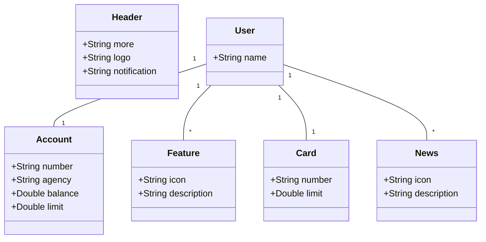

# Santander Backend com Java 2025
***

```mermaid
classDiagram
    class Header {
        +String more
        +String logo
        +String notification
    }

    class User {
        +String name
    }

    class Account {
        +String number
        +String agency
        +Double balance
        +Double limit
    }

    class Feature {
        +String icon
        +String description
    }

    class Card {
        +String number
        +Double limit
    }

    class News {
        +String icon
        +String description
    }

    User "1" -- "1" Account
    User "1" -- "*" Feature
    User "1" -- "1" Card
    User "1" -- "*" News

```
